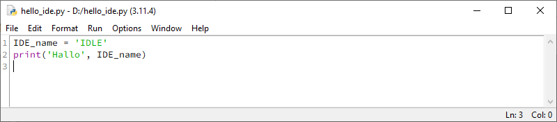

Python programmeeromgeving
==========================

Zoals je voor het maken van tekstdocumenten een programma als Microsoft Word gebruikt en voor het maken van computer graphics een applicatie als Paint of Adobe Photoshop, zo gebruik je voor het schrijven van computerprogramma's een *programmeeromgeving*. Meestal duiden we zo'n programmeeromgeving aan met de Engelse afkorting :term:`IDE`. Voor programmeren in Python is een ruime keuze aan IDE's voorhanden en ze zijn in te delen in twee categorieën:

.. list-table::
    :align: center

    * - Offline 
      - Online
    * - .. image:: ../images/offline_small.png
            :scale: 25%
      - .. image:: ../images/online_small.png
            :scale: 25%

Beide soorten hebben hun voor- en nadelen. Voor een online IDE heb je alleen een webbrowser nodig, waardoor je zelfs op een smartphone je code kunt typen. Je moet echter altijd met internet zijn verbonden om aan je project te kunnen werken. Een offline IDE is een applicatie die je op je PC installeert. Dat is in het begin iets meer werk, maar daar staat tegenover dat je je code :abbr:`lokaal (lokaal = op je eigen PC)` kunt opslaan en vaak meer geavanceerde opties tot je beschikking hebt.

Offline IDE's
-------------

IDLE
^^^^

   IDLE

*IDLE* is de IDE van de makers van Python zelf. Wanneer je Python installeert, krijg je *IDLE* er automatisch bij. Het is een prima programmeeromgeving voor eenvoudige Python projecten.

| Python downloaden: https://www.python.org/.

Mu
^^^

*Mu* is een Python IDE speciaal gemaakt voor scholieren die willen leren programmeren. De duidelijke knoppenbalk maakt deze IDE heel gebruiksvriendelijk. Bovendien heeft *Mu* een ingebouwde :term:`Pygame Zero` mode om games te programmeren.

| Mu downloaden: https://codewith.mu/.

   Mu

Visual Studio Code
^^^^^^^^^^^^^^^^^^

Veel gevorderde programmeurs gebruiken *Visual Studio Code* voor hun projecten. Deze IDE van Microsoft is niet speciaal gemaakt voor Python, je kunt er met vrijwel alle bestaande programmeertalen in werken, waaronder C#, JavaScript en PHP. De grote verscheidenheid aan mogelijkheden, maakt dat je niet zomaar met *VS Code* aan de slag kunt, je moet echt leren ermee te werken. 

| Visual Studio Code downloaden: https://code.visualstudio.com/
| Python in Visual Studio Code: https://code.visualstudio.com/docs/python/python-tutorial

   Visual Studio Code

Online IDE's
------------

Replit
^^^^^^

...