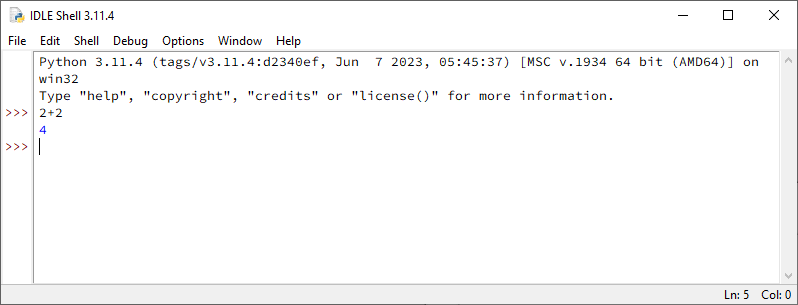
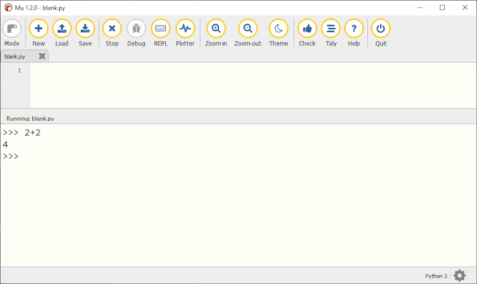
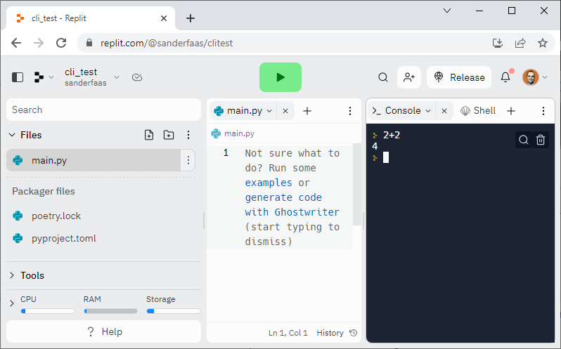

Berekeningen in de CLI
======================

Het woord 'computer' komt van het Latijnse computare, dat 'berekenen' betekent. Soms ook wordt een computer gekscherend een uit de kluiten gewassen rekenmachine genoemd. Het is vrijwel onmogelijk een computerprogramma te maken waarin niets wordt berekend. Daarom is het belangrijk dat je leert hoe rekenen in Python werkt.

De CLI
------
In dit hoofdstuk gebruik je de :term:`CLI`, de Command Line Interface. De CLI wordt ook wel *Interactieve Prompt* genoemd. *Interactief* geeft aan dat je direct met Python communiceert: je typt een commando, drukt op Enter en ziet meteen het resultaat. *Prompt* staat voor het symbool dat aangeeft dat je een commando kunt typen. In Python is dat vaak ˃˃˃.

.. prompt:: python ˃˃˃ auto
    
    ˃˃˃ 2+2
    4
    ˃˃˃

Hieronder lees je waar je de CLI kunt vinden in IDLE, Mu en Replit.

CLI in IDLE
^^^^^^^^^^^

In IDLE is de CLI het eenvoudigst te vinden. Je krijgt hem namelijk meteen te zien wanneer je IDLE opstart.

   CLI in Python IDLE

CLI in Mu
^^^^^^^^^

In Mu dien je een paar extra stappen uit te voeren om bij de CLI te komen. Mu start namelijk standaard met een bestand waarin je programmacode kunt typen. Laat dit bestand leeg, maar sla het wel op, bijvoorbeeld onder de naam :file:`blank.py`. Klik daarna op de Run knop om de (niet bestaande) code uit te voeren. Daardoor wordt in het onderste deel van het Mu venster de CLI geopend.

   CLI in Mu

CLI in Replit
^^^^^^^^^^^^^
In Replit wordt de CLI *Console* genoemd. Dit tabblad wordt standaard geopend, maar mocht dat niet het geval zijn, dan kun je het altijd toevoegen door op de + te klikken naast de geopende tabbladen. Merk op dat Replit niet de standaard Python prompt gebruikt, maar slechts één ˃.

   CLI (Console) in Replit

Optellen, aftrekken, vermenigvuldigen en delen
----------------------------------------------

