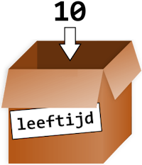

.. role:: python(code)
    :language: python

.. |br| raw:: html

     

Variabelen
==========

Stel je de volgende situatie eens voor:

.. topic:: Zakgeld

    De opa en oma van Alan hebben acht kleinkinderen en geven aan elk van hen wekelijks een zakcentje. Omdat ze aan de oudere kleinkinderen meer zakgeld willen geven dan de jongere, hebben ze het volgende systeem bedacht: elk kleinkind krijgt 1 euro en daarbij per levensjaar nog 50 cent.

    Alan is 10 jaar oud en hij krijgt van opa en oma dus €1,00 + 10 :math:`\times` €0,50 = €6,00.

Alans opa en oma moeten voor dit systeem acht keer dezelfde berekening maken, telkens met een andere leeftijd. Dat is nog wel te doen, maar stel dat opa en oma vijftig kleinkinderen hadden? Of dat de berekening veel ingewikkelder zou zijn? Dan zouden opa en oma beter een computerprogramma gebruiken, want daarin kun je met variabelen werken!

In de zakgeldberekening zijn de waarden €1,00 en €0,50 constanten; ze veranderen niet. De waarde die *variabel* is, is de leeftijd. Voor de berekening van het zakgeld, kun je een formule gebruiken met de variabele :python:`leeftijd`:

.. code-block:: python

    1.00 + leeftijd * 0.50

Nu hoeven opa en oma slechts voor elk kleinkind de waarde van :python:`leeftijd` in te vullen en het computerprogramma voert de berekening uit.

Waarden opslaan
---------------
Na het bovenstaande zakgeldvoorbeeld zou je kunnen denken dat een variabele een woord is dat een getal vervangt in een berekening. Een variabele is echter meer dan dat. Het is een plek in het geheugen van de computer die je een naam kunt geven en waarin je een waarde kunt opslaan. Die waarde kan een getal zijn, maar ook tekst of iets anders. Vaak wordt een variabele vergeleken met een doosje, voorzien van een label dat aangeeft wat er in zit.

   In een variabele kun je een waarde opslaan

Om in Python een waarde op te slaan in een variabele gebruik je een *assignment statement*. Assignment betekent toekenning: je kent een waarde toe aan de variabele. Python gebruikt hiervoor de assignment operator :python:`=`.

.. prompt:: python >>> auto
    
    >>> leeftijd = 10

Met deze ene regel code bewerkstellig je drie dingen:

1. Er wordt een plek in het geheugen gereserveerd.
2. De plek in het geheugen krijgt de naam :python:`leeftijd`.
3. Op de plek in het geheugen wordt de waarde :python:`10` opgeslagen.

Vervolgens kun je de variabele gebruiken in berekeningen. Wanneer je in de CLI de naam van de variabele typt en op :kbd:`Enter` drukt, toont Python de waarde.

.. prompt:: python >>> auto
    
    >>> leeftijd = 10
    >>> leeftijd
    10
    >>> leeftijd + 2
    12

Je kunt in een variabele slechts één waarde tegelijkertijd opslaan. Wanneer je een nieuwe waarde in een variabele opslaat, wordt de oude weggegooid.

.. prompt:: python >>> auto

    >>> leeftijd = 10
    >>> leeftijd
    10
    >>> leeftijd = 3
    >>> leeftijd
    3

De uitkomst van een berekening kun je natuurlijk ook opslaan in een variabele, zoals hieronder getoond.

.. prompt:: python >>> auto

    >>> leeftijd = 10
    >>> zakgeld = 1 + leeftijd * 0.5
    >>> zakgeld
    6.0
    >>> leeftijd = 3
    >>> zakgeld
    6.0

Deze code berekent het zakgeldbedrag en slaat het resultaat op in de variabele :python:`zakgeld`. Vervolgens krijgt de variabele :python:`leeftijd` de waarde :python:`3`, maar de waarde van :python:`zakgeld` blijft ongewijzigd; er is immers geen nieuwe waarde aan toegekend. Om dat te verhelpen, zou je het volgende moeten doen:

.. prompt:: python >>> auto

    >>> leeftijd = 10
    >>> zakgeld = 1 + leeftijd * 0.5
    >>> zakgeld
    6.0
    >>> leeftijd = 3
    >>> zakgeld = 1 + leeftijd * 0.5
    >>> zakgeld
    2.5

Naamgeving
----------
Een goede variabelenaam beschrijft de data die de variabele bevat. Stel je voor dat je gaat verhuizen en op alle verhuisdozen het etiket 'Spullen' plakt. Je zou niks meer kunnen terugvinden! In Python mag je je variabelen vrijwel elke naam geven die je maar wilt, zolang hij voldoet aan de volgende regels:

* De naam mag enkel letters, cijfers en het underscore karakter :python:`_` bevatten. Spaties zijn dus niet toegestaan.
* De naam mag niet met een cijfer beginnen.
* De naam mag geen *gereserveerd woord* zijn.

Gereserveerde woorden (*keywords*) hebben al een betekenis in Python en daarom kun je ze niet als variabelenaam gebruiken. Met het commando :python:`help('keywords')` kun je in de CLI de lijst van keywords opvragen:

.. prompt:: python >>> auto

    >>> help('keywords')
    Here is a list of the Python keywords.  Enter any keyword to get more help.

    False               class               from                or
    None                continue            global              pass
    True                def                 if                  raise
    and                 del                 import              return
    as                  elif                in                  try
    assert              else                is                  while
    async               except              lambda              with
    await               finally             nonlocal            yield
    break               for                 not              

Hieronder zie je enkele voorbeelden van geldige en ongeldige variabelenamen.

+----------------------------+-------------------------------------------------------------+
| Geldige variabelenaam      | Ongeldige variabelenaam                                     |
+============================+=============================================================+
| :python:`favoriete_kleur`  | :python:`favoriete-kleur` (streepjes mogen niet)            |
+----------------------------+-------------------------------------------------------------+
| :python:`favorieteKleur`   | :python:`favoriete kleur` (spaties mogen niet)              |
+----------------------------+-------------------------------------------------------------+
| :python:`speler2`          | :python:`2speler` (geen cijfer aan het begin)               |
+----------------------------+-------------------------------------------------------------+
| :python:`_42`              | :python:`42` (geen cijfer aan het begin)                    |
+----------------------------+-------------------------------------------------------------+
| :python:`TOTALE_SOM`       | :python:`TOTALE_$OM` (speciale karakters als $ mogen niet)  |
+----------------------------+-------------------------------------------------------------+
| :python:`hoi`              | :python:`'hoi'` (speciale karakters als ' mogen niet)       |
+----------------------------+-------------------------------------------------------------+
| :python:`password`         | :python:`pass` (keywords mogen niet)                        |
+----------------------------+-------------------------------------------------------------+

Variabelenamen zijn hoofdlettergevoelig (*case-sensitive*), wat betekent dat :python:`spam`, :python:`SPAM`, :python:`Spam` en :python:`sPaM` vier verschillende variabelen zijn. Hoewel :python:`Spam` een geldige variabelenaam is, is het gebruikelijk in Python om variabelenamen te beginnen met een kleine letter. De `stijlgids voor Python code <https://peps.python.org/pep-0008/#function-and-variable-names>`_ schrijft voor:

.. pull-quote:: 

    Variable names should be lowercase, with words separated by underscores as necessary to improve readability.

    -- PEP 8 - Style Guide for Python Code

Dus gebruik liever :python:`aantal_appels` dan :python:`aantalAppels` als variabelenaam.

.. note::

    In boeken over Python en zelfs in de officiële documentatie kom je regelmatig de variabelenamen :python:`spam`, :python:`eggs` en :python:`bacon` tegen. Die namen zijn afkomstig uit een sketch van de beroemde Engelse komediegroep `Monty Python <https://nl.wikipedia.org/wiki/Monty_Python>`_ waaraan de programmeertaal haar naam dankt. Monty Python's Flying Circus was een favoriet televisieprogramma van Guido van Rossum, de Nederlandse bedenker van Python (`bron <https://docs.python.org/3/faq/general.html#why-is-it-called-python>`_).

    Voor code waarin de variabelen geen speciale betekenis hebben, kun je dit soort namen prima gebruiken, maar voor een variabele die wél een betekenis heeft, is een beschrijvende naam beter.