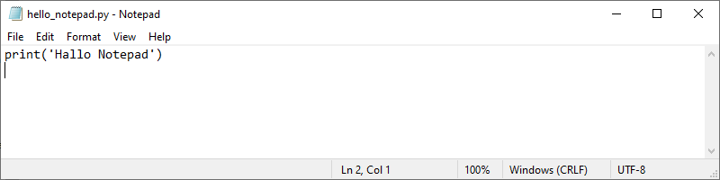
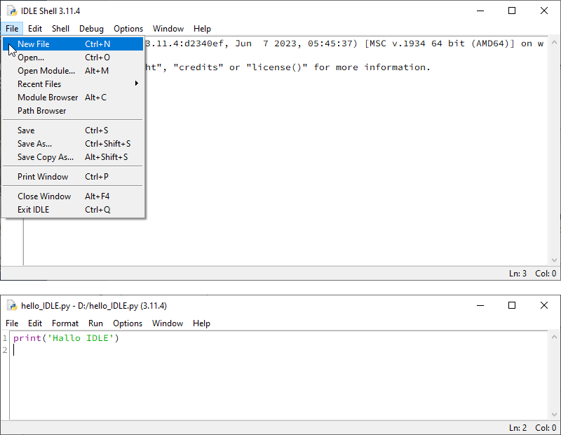
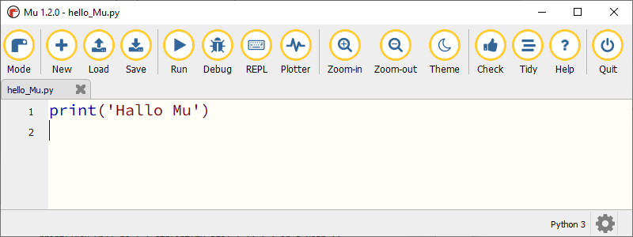
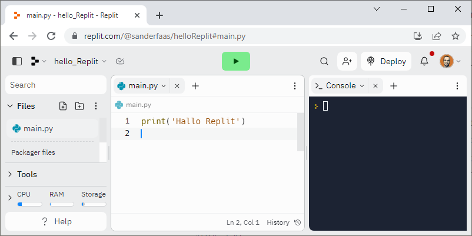

.. role:: python(code)
    :language: python

Je eerste programma
===================

De CLI is heel geschikt om direct met Python te communiceren: je typt een instructie, drukt op :kbd:`Enter` en Python geeft meteen het resultaat. Dat is handig wanneer je snel even iets wilt testen, maar niet wanneer je een echt programma wilt schrijven; daarvoor heb je de *editor* nodig. In dit hoofdstuk ga je die gebruiken.

De editor
---------
Elke :term:`IDE` heeft een editor: een omgeving waarin je codebestanden kunt aanmaken, bewerken en opslaan. Strikt genomen heb je voor het maken van programma's niet per se een :term:`IDE` nodig, je zou ook Python programma's kunnen schrijven in bijvoorbeeld Windows Notepad. Je gebruikt dan Notepad als editor. Echter, de code editors in IDE's zijn vaak voorzien van handige snufjes die je helpen bij het programmeren, zoals regelnummering, automatisch markeren van keywords en automatisch inspringen van regels.

   Windows Notepad

Editor in IDLE
^^^^^^^^^^^^^^
Bij het opstarten van IDLE beland je in de CLI. Om de editor te starten ga je in het :guilabel:`File` menu naar :guilabel:`New File`. Dit opent een venster waarin je programmacode kunt typen. Je kunt je code naderhand opslaan onder een eigen naam via :guilabel:`File` | :guilabel:`Save as...`. Code uitvoeren doe je via :guilabel:`Run` | :guilabel:`Run Module`.

   De IDLE editor

Editor in Mu
^^^^^^^^^^^^
In Mu was het opstarten van de CLI enigszins omslachtig, maar voor de editor hoef je niets te doen, die is er al meteen. De knoppen :guilabel:`New`, :guilabel:`Load`, :guilabel:`Save` en :guilabel:`Run` spreken voor zich. Zorg er wel voor dat Mu is ingesteld op Python 3 mode; je ziet dat rechtsonder in de statusbalk van het venster. Mocht er iets anders staan, klik dan op de :guilabel:`Mode` knop om Python 3 te kiezen.

   De Mu editor

Editor in Replit
^^^^^^^^^^^^^^^^
Ook in Replit is de editor meteen voorhanden, er is zelfs al een bestand geopend: :file:`main.py`. In IDLE en Mu kun je je codebestand zelf een naam geven, maar in Replit is het onverstandig de naam :file:`main.py` te wijzigen; je programma wordt dan niet meer uitgevoerd wanneer je op de :guilabel:`Run` knop klikt. Replit slaat je code voortdurend automatisch op, daar hoef je zelf niks voor te doen. Mocht je je :file:`main.py` bestand per ongeluk hebben gesloten, dan kun je het weer openen door op de naam te klikken in de sidebar aan de linkerkant.

   De editor in Replit

Hello, World!
-------------

Het eerste programma dat elke programmeur maakt wanneer zij/hij een nieuwe programmeertaal leert, heeft de naam *Hello, World!* Deze traditie bestaat al sinds de jaren 70 van de vorige eeuw (`bron <https://nl.wikipedia.org/wiki/Hello_world_(programma)>`_). Het is een heel simpel programma dat niets anders doet dan de tekst Hello, World! op het scherm tonen. Waarschijnlijk kun je de code al voorspellen:

.. code-block:: python
    :linenos:
    :caption: hello_world.py
    :name: hello_world

    # Dit is mijn eerste programma
    print('Hello, World!')

Had je de eerste regel van deze code ook voorspeld? Vast niet, want dit is een zogenoemde commentaarregel. Met het hekje (:python:`#`) laat je Python weten dat het deze regel kan negeren bij het uitvoeren van de code. Voer deze twee regels in en run het programma. Controleer dat de tekst Hello, World! wordt getoond in de CLI.

.. note:: 
    Als Python niks doet met commentaar, waarom zou je het dan opnemen in je code? Er zijn programmeurs die geen of nauwelijks commentaar bij hun code schrijven omdat ze het zonde van hun tijd vinden, of omdat ze vinden dat de code voor zich spreekt. Echter, wanneer iemand anders jouw code moet doorgronden (bijvoorbeeld wanneer je met meerdere programmeurs samenwerkt aan het ontwikkelen van een game), is enige toelichting wel handig. En ook voor jezelf kan commentaar nuttig zijn, om het overzicht te bewaren en als geheugensteuntje voor wanneer je na enige jaren een stuk code opnieuw bekijkt en je je niet meer kunt herinneren wat je precies hebt geprogrammeerd.

Verschil tussen editor en CLI
-----------------------------
Het belangrijkste verschil tussen werken in de editor en werken in de CLI is, zoals al eerder gezegd, dat je in de CLI slechts één instructie per keer kunt geven en dat je in de editor vele regels code kunt schrijven die als geheel worden uitgevoerd. Een ander belangrijk verschil zit in de manier waarop je de waarde van een variabele kunt tonen. In de CLI doe je dat door de variabelenaam te typen en op :kbd:`Enter` te drukken:

.. prompt:: python >>> auto
    
    >>> aantal_knikkers = 42
    >>> aantal_knikkers
    42

Echter wanneer je deze code in de editor typt en uitvoert, verschijnt er geen resultaat.

.. code-block:: python
    :linenos:
    :caption: knikkers.py

    aantal_knikkers = 42
    aantal_knikkers 

.. prompt:: python >>> auto
    
    >>>

Om de inhoud van de variabele :python:`aantal_knikkers` af te drukken op het scherm, moet je de functie :python:`print()` gebruiken, die eerder ook in :file:`hello_world.py` zag:

.. code-block:: python
    :linenos:
    :caption: knikkers.py

    aantal_knikkers = 42
    print(aantal_knikkers)

.. prompt:: python >>> auto
        
    42
    >>>